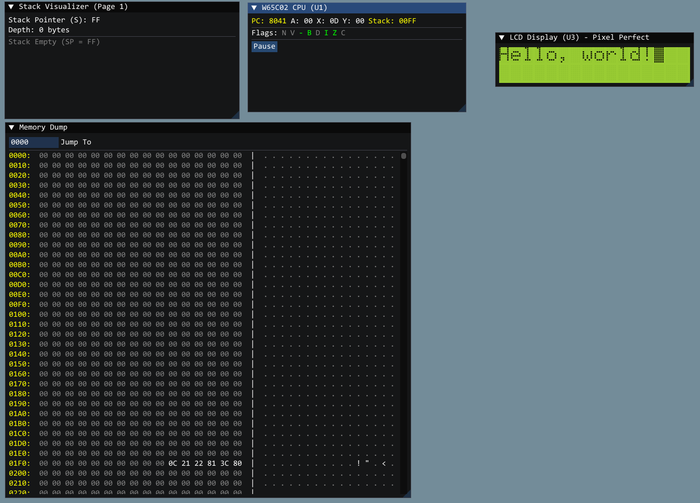
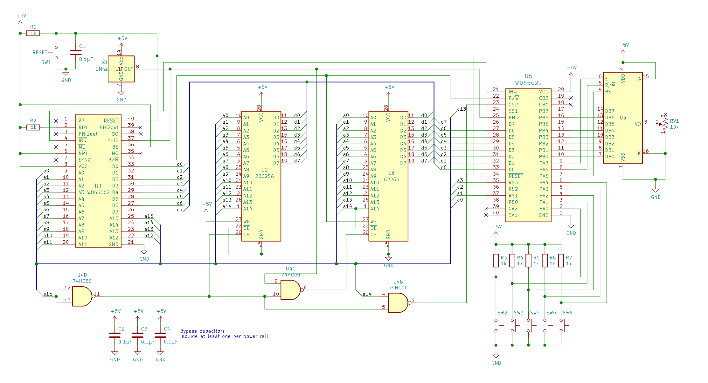

# 6502-Emulator

A cycle-accurate, component-level emulator of the Ben Eater 6502 breadboard computer. This project simulates the hardware behavior of the W65C02S CPU, W65C22 VIA, and NHD-0216K1Z LCD (in 8-bit mode), wrapped in a modern graphical debugger built with Dear ImGui.

(Emulator running "Hello, world!" with blinking block cursor)

##  Table of Contents
- [About The Project](#about-the-project)
- [Hardware Architecture](#hardware-architecture)
- [Directory Structure](#directory-structure)
- [Features](#features)
- [Getting Started](#getting-started)
- [Usage](#usage)
- [Media Gallery](#media-gallery)

 About The Project

This emulator goes beyond simple instruction simulation. It models the physical interconnects of the breadboard computer, including address decoding logic, memory mapping, and peripheral interface adapters.

The core goal is to provide a development environment that faithfully reproduces the quirks and constraints of the physical hardware, such as:

Bus-level accuracy: Peripheral chips (VIA, ACIA) are accessed via memory-mapped I/O logic consistent with the 74HC00 NAND gate address decoder.

LCD Controller State Machine: The ST7066U controller is emulated in detail, including its initialization sequence, internal RAM (DDRAM/CGRAM), and 4-bit data bus interface.

ROM Generation: Includes a custom C++ based assembler/generator to create binary ROM images directly from code.

 Hardware Architecture

The emulator replicates the following schematic:

(6502 Breadboard Computer Schematic)

Emulated Components

|Component   |     Type    |           Function            |          Notes                              |
| :--- | :---: | :---: | :--- |
|W65C02S     |    CPU      |   Central Processing Unit     |    Full instruction set supported (CMOS).   |
|W65C22      |    VIA      |   Versatile Interface Adapter |    Handles I/O for the LCD (Port A/B).      |
|W65C51      |    ACIA     |   Asynchronous Comm Interface |    UART for serial communication.           |
|NHD-0216K1Z |    LCD      |   2x16 Character Display      |    ST7066U Controller, wired in 4-bit mode. |
|AT28C256    |    ROM      |   32KB EEPROM                 |    Mapped to $8000 - $FFFF.                 |
|62256       |    RAM      |   32KB SRAM                   |    Mapped to $0000 - $3FFF.                 |


 **Directory Structure**

The project is organized by hardware device types, drivers, and UI components.

(Project Source Tree)
```
6502/
├── build/               # Compiled binaries
├── src/
│   ├── devices/         # Hardware Component Emulation
│   │   ├── cpu/
│   │   │   ├── m6502.cpp      # W65C02S Core Logic
│   │   │   └── m6502.h
│   │   ├── io/
│   │   │   ├── w65c22.cpp     # VIA Implementation
│   │   │   ├── w65c22.h
│   │   │   ├── w65c51.cpp     # ACIA Implementation
│   │   │   └── w65c51.h
│   │   ├── logic/
│   │   │   └── 74hc00.h       # NAND Gate logic
│   │   ├── memory/
│   │   │   ├── 28c256.cpp     # EEPROM
│   │   │   └── 62256.cpp      # SRAM
│   │   └── video/
│   │       ├── nhd_0216k1z.cpp # LCD Controller (ST7066U)
│   │       └── nhd_0216k1z.h
│   ├── driver/
│   │   ├── mainboard.cpp      # System wiring (Address Map, Interrupts)
│   │   └── mainboard.h
│   ├── emu/                   # Emulation Framework (Base classes)
│   │   ├── device.h
│   │   ├── di_execute.h
│   │   ├── di_memory.h        
│   │   ├── machine.h          # Base class for the machine
│   │   ├── map.h              # Address Mapping
│   │   └── types.h
│   ├── ui/                    # Graphical User Interface
│   │   ├── views/
│   │   │   ├── debug_view.cpp # Debugger Windows & Tools
│   │   │   └── debug_view.h
│   │   ├── renderer.cpp       # OpenGL/SDL/ImGui Backend
│   │   └── renderer.h
│   └── main.cpp               # Entry Point
├── tools/
│   └── rom_build.py           # C++ Assembly Tool for Firmware
├── vendor/                    # Third-party libraries (ImGui, GLFW, etc.)
└── Makefile                   # Build Configuration
```

 Features

 Accurate LCD Emulation

Unlike generic text outputs, this emulator simulates the ST7066U controller.

4-Bit Interface: Correctly reassembles nibbles sent from the VIA Port B.

Visual Fidelity: Renders characters using a retro green-on-black aesthetic.

Full Command Set: Supports Clear, Home, Entry Mode, and custom cursor behavior (Blinking Block 0xFF).

CGROM Mapping: Correctly maps special ROM codes (like 0x7E → →) to UTF-8 for display.

 Visual Debugger

Real-time CPU State: View A, X, Y registers, Stack Pointer, and Status Flags (NV-BDIZC).

Stack Visualizer: Inspect the stack memory page ($0100 - $01FF) in real-time.

Execution Control: Step-by-step execution or full-speed running (locked to 1MHz).

 Integrated ROM Generator

Includes a rom_generator tool that allows you to write "Assembly-in-C++". It compiles directly to a rom.bin file, handling label resolution and opcode emission automatically.

 Getting Started

Prerequisites

* **C++ Compiler** (GCC/Clang/MSVC) supporting C++17.

* **Make** (or CMake if configured).

* **Libraries:**
    * **asio**

    * **SDL2**

    * **OpenGL / GLFW**

    * **Dear ImGui** (Included in vendor/)

Installation

1.  **Clone the repository**

git clone [https://github.com/yourusername/6502-emulator.git](https://github.com/yourusername/6502-emulator.git)
cd 6502-emulator


2. **Generate the ROM**
Before running the emulator, you must generate the firmware.

# Compile and run the generator
python tools\rom_build.py

# This creates 'rom.bin' in the root directory
rom.bin

3. **Build the Emulator**

make clean
make


4. **Run**

./build/eater.exe

 Media Gallery

**CPU & Stack Inspector**



This is a Emulator based on Ben Eaters 6502 computer and first schematic without the Serial interface, I have started the modeling for that interface.




Ben's Schematic with the Serial Interface 


License

Distributed under the MIT License. See `LICENSE` for more information.